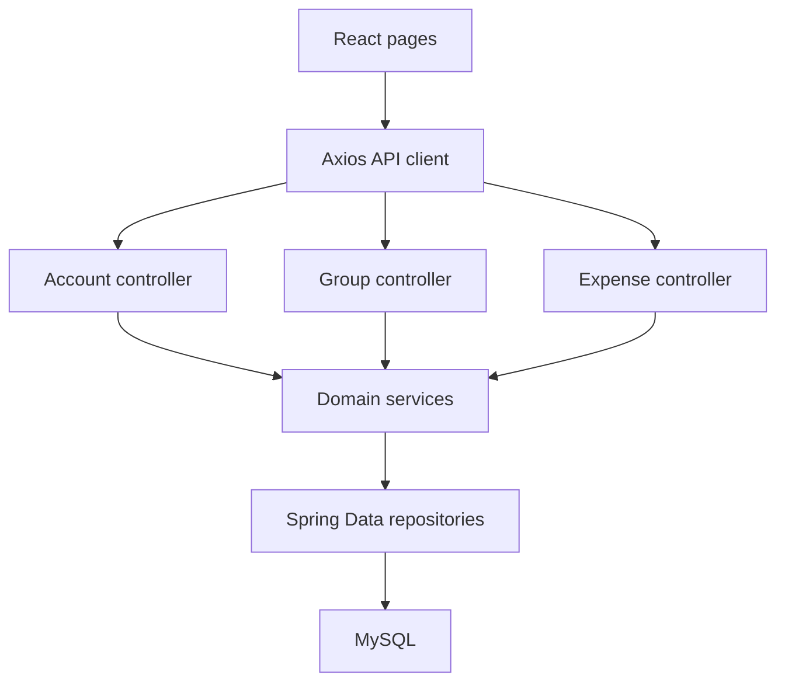

<div align="center">


# FairShare

### Transparent expenses. Hassle-free settlements.

A full-stack expense-sharing application for roommates, trips, and teams — built with **Java, Spring Boot, React, and MySQL**.

[](https://github.com/KhushiShah-swe/fairshare-app/actions/workflows/ci.yml)


🚀 **[Live Demo](https://fairshare-frontend-production-c31e.up.railway.app)** · [Watch the demo](https://youtu.be/GIe5kEu0w4Q) · [Run locally](docs/SETUP.md) · [Architecture](docs/ARCHITECTURE.md) · [API reference](docs/API.md) · [Roadmap](docs/ROADMAP.md)

**Maintained by [Khushi Shah · @KhushiShah-swe](https://github.com/KhushiShah-swe)**

</div>

## Why FairShare?

A shared grocery run, a weekend trip, or a household bill creates the same questions: **Who paid? Who participated? Who owes whom?** FairShare brings expenses, split allocations, receipts, and balances into one place, so groups can review their spending without maintaining a separate spreadsheet.

The project follows the complete software development cycle: release planning, user stories, three development sprints, a React interface, a layered Spring Boot API, relational data modeling, automated tests, and continuous integration.

**Project status:** deployed full-stack application on Railway. Try the live application at **[fairshare-frontend-production-c31e.up.railway.app](https://fairshare-frontend-production-c31e.up.railway.app)**. Authentication, authorization, and settlement-history improvements are tracked in the [roadmap](docs/ROADMAP.md).

## Explore the project in a few minutes

| Explore | What to look for |
| --- | --- |
| [Live application](https://fairshare-frontend-production-c31e.up.railway.app) | Try the deployed FairShare application running on Railway |
| [Sprint 3 demo](https://youtu.be/GIe5kEu0w4Q) | A recorded walkthrough of the final sprint's settlement and payment-reference screens |
| [Project case study](docs/CASE_STUDY.md) | The problem, product decisions, delivery process, and engineering lessons |
| [Architecture and data model](docs/ARCHITECTURE.md) | How React, REST controllers, services, repositories, and MySQL fit together |
| [Tests and CI](docs/TESTING.md) | Existing test scope, verification commands, and coverage configuration |
| [Sprint documentation](docs/README.md) | Release planning, presentations, demos, and linked milestone history |

## Features

| Capability | Current implementation |
| --- | --- |
| Accounts | Signup and login flows, with a dashboard for the selected user |
| Groups | Create household/trip/team groups, join through a six-character invite code, view members, rename a group, and leave or delete a group |
| Expenses | Add, edit, and delete expenses with a description, payer, amount, category, date, notes, and participants |
| Flexible splits | Equal or percentage allocation across selected participants; percentage totals are validated |
| Receipts | Attach, view, replace, or remove image/PDF receipts; upload requests are limited to 5 MB |
| Dashboard | Per-group balances, amounts owed or receivable, recent activity, and Recharts visualizations |
| Settlement instructions | Consolidate repeated participant-to-payer debts into readable payment instructions |
| Balance export | Download a CSV containing expenses, net balances, and settlement instructions |
| Zelle reference details | Save payment email/phone details and upload/view a QR image for payments completed outside FairShare |

See [current boundaries](#current-boundaries) for the distinction between these features and planned enhancements.

## Quick start

Requirements: **JDK 17**, **Maven 3.9.x**, **Node.js 22.12+**, **npm**, and a local **MySQL 8.x** server. The existing GitHub workflow uses Node 20; the setup guide uses a compatible modern local runtime without changing the workflow.

```bash
git clone https://github.com/KhushiShah-swe/fairshare-app.git
cd fairshare-app
```

Create a local database and user using the [MySQL setup instructions](docs/SETUP.md#1-prepare-mysql). Then start the backend in one terminal:

```bash
cd backend/fairshare-backend
export SPRING_DATASOURCE_URL='jdbc:mysql://localhost:3306/fairshare?useSSL=false&serverTimezone=UTC'
export SPRING_DATASOURCE_USERNAME='fairshare'
read -rsp 'Local MySQL password: ' SPRING_DATASOURCE_PASSWORD; echo
export SPRING_DATASOURCE_PASSWORD
mvn spring-boot:run
```

In another terminal, from the repository root:

```bash
cd frontend/fairshare-frontend
npm ci
npm run dev -- --host localhost --port 5173 --strictPort
```

Open **http://localhost:5173**, create a demo account, and create your first group. The API runs at **http://localhost:8080/api**. The application currently expects these local addresses.

For **Windows PowerShell**, environment setup, troubleshooting, and a complete demo scenario, follow [SETUP.md](docs/SETUP.md).

## Architecture



The backend separates HTTP handling, business logic, and persistence. Expenses store their participant allocations, and the app derives balances from the payer and split records. Receipt and QR files are stored as database blobs. Read [Architecture](docs/ARCHITECTURE.md) for the entity relationships and tradeoffs.

### Technology choices

| Area | Technology |
| --- | --- |
| Frontend | React 18, React Router 6, Vite 7, JavaScript/JSX, CSS |
| UI integration | Axios, Recharts, React Toastify |
| Backend | Java 17, Spring Boot 3.2.3, Spring Web, Spring Data JPA/Hibernate |
| Persistence | MySQL, relational entities, blob storage for attachments |
| Backend verification | JUnit 5, Mockito, Maven Surefire, JaCoCo |
| Frontend verification | Vitest and jsdom |
| Delivery process | GitHub Actions CI, user stories, sprint milestones, reviews and retrospectives |

### Repository map

| Location | Purpose |
| --- | --- |
| [`backend/fairshare-backend/src/main`](backend/fairshare-backend/src/main) | Java controllers, services, models, repositories, and configuration |
| [`backend/fairshare-backend/src/test`](backend/fairshare-backend/src/test) | Backend controller and service unit tests |
| [`frontend/fairshare-frontend/src`](frontend/fairshare-frontend/src) | React pages, API client, components, styles, and frontend checks |
| [`.github`](.github) | Existing CI workflow, issue forms, PR template, and maintainer ownership |
| [`docs`](docs/README.md) | Developer guides, case study, sprint presentations, and demo links |

The repository also retains historical generated reports. [`.gitattributes`](.gitattributes) marks those outputs as generated so GitHub's language statistics represent the authored source.

## Testing and continuous integration

The existing suite contains **98 backend unit tests** across four classes and **5 frontend logic checks**. Backend tests use mocked dependencies; the frontend checks exercise small logic examples. Their scope and remaining integration-test opportunities are explained in [TESTING.md](docs/TESTING.md).

```bash
# From backend/fairshare-backend
mvn clean verify

# From frontend/fairshare-frontend
npm ci
npm test
npm run build
```

[FairShare CI Build](.github/workflows/ci.yml) runs on pushes and pull requests. It executes Maven verification, uploads JaCoCo and Surefire reports, and runs Vitest. The current JaCoCo minimum is **1% line coverage**; the configured gate and observed report coverage are different measures. Frontend production building is a local verification command, not an existing CI step.

The current workflow provides **continuous integration**. It does not publish or deploy the application. The badge above links to live workflow results.

## Three-sprint delivery

| Sprint | Focus | Recorded issue estimates | Evidence |
| --- | --- | --- | --- |
| [Sprint 1](https://github.com/KhushiShah-swe/fairshare-app/milestone/2) | Accounts, groups, expenses, equal splits, balances | 37 points across 7 stories | [Demo](https://youtu.be/nV-iAE6gtnw) · [Presentation](docs/Sprint%201.pdf) |
| [Sprint 2](https://github.com/KhushiShah-swe/fairshare-app/milestone/3) | Selected participants, percentage splits, receipts | 21 points across 3 stories | [Demo](https://youtu.be/c3UXRfElc08) · [Presentation](docs/Sprint%202%20.pdf) |
| [Sprint 3](https://github.com/KhushiShah-swe/fairshare-app/milestone/4) | CSV export, settlement instructions, reset workflow, Zelle details | 26 points across 4 stories | [Demo](https://youtu.be/GIe5kEu0w4Q) · [Presentation](docs/SPRINT%203.pdf) |

These are the estimates recorded on issues #1–#14, totaling **84 story points**. Story points measure relative planned effort. Historical issue closure does not establish that every acceptance criterion has automated coverage. The [documentation index](docs/README.md) links the original release plan and sprint evidence.

## Current boundaries

- **Local demonstration:** account protection and server-side permission enforcement need further work before use with real financial or personal data.
- **Settlement behavior:** the current plan groups direct debts. Global debt minimization and a durable, auditable payment ledger are future work. The dashboard's individual settlement action still needs its matching API implementation.
- **Clear All Debts:** the current operation deletes the group's expenses and split records. Use it only with disposable demo data; preserving history is a roadmap item.
- **Payment references:** Zelle payments occur through the user's bank. FairShare does not initiate transfers or verify payment completion.
- **Deployment:** the React frontend, Spring Boot backend, and MySQL database are deployed on Railway. The production frontend uses a configurable API URL while local development falls back to localhost.
- **Future scope:** exact-amount splits, PDF balance exports, stronger monetary precision, and full browser/API integration coverage remain planned work.

See the [prioritized roadmap](docs/ROADMAP.md) for concrete next steps.

## Maintainer and project resources

**Khushi Shah · [@KhushiShah-swe](https://github.com/KhushiShah-swe)**
[Project documentation](docs/README.md) · [Issues](https://github.com/KhushiShah-swe/fairshare-app/issues) · [Contributing](CONTRIBUTING.md) · [Security policy](SECURITY.md)

For project inquiries: **khushishah.r.009@gmail.com**.

**License:** no LICENSE file is currently included. Contact the maintainer about reuse.
