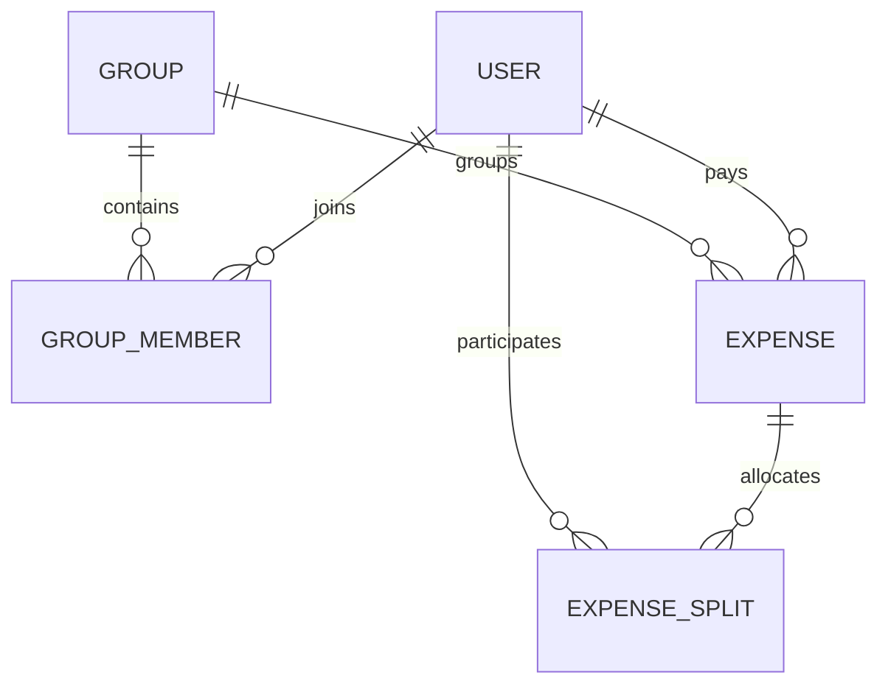
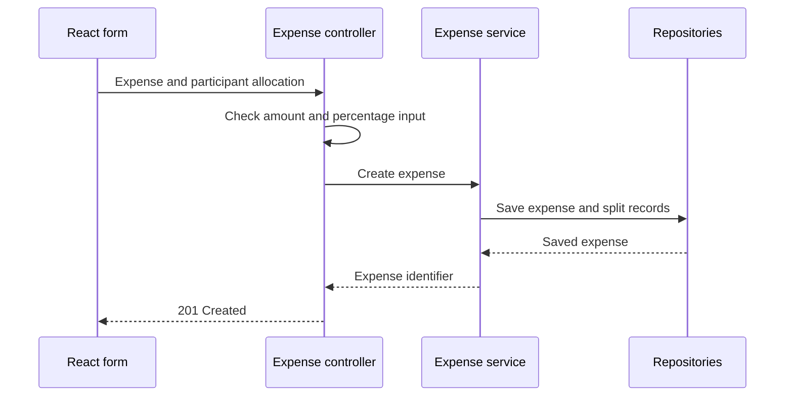

# Architecture and engineering decisions

[Back to the project](../README.md) · [API reference](API.md) · [Roadmap](ROADMAP.md)

FairShare is a React single-page application backed by one Spring Boot service and MySQL. The implementation is deliberately approachable for a course project: a single backend deployment, recognizable domain objects, and separate controller, service, and repository packages.

## Application boundaries

| Layer | Responsibilities | Source |
| --- | --- | --- |
| React pages | Forms, navigation, group views, balances, receipts, and charts | `frontend/fairshare-frontend/src/pages/` |
| API client | Axios requests to localhost:8080 with credentials enabled | `frontend/fairshare-frontend/src/api/api.js` |
| Controllers | HTTP routes, request parsing, responses, and selected validation | `backend/fairshare-backend/src/main/java/com/fairshare/controller/` |
| Services | Group rules, expense allocation, attachment handling, balances, exports | `backend/fairshare-backend/src/main/java/com/fairshare/service/` |
| Repositories | Spring Data persistence access | `backend/fairshare-backend/src/main/java/com/fairshare/repository/` |
| Models | Users, groups, memberships, expenses, and splits | `backend/fairshare-backend/src/main/java/com/fairshare/model/` |

## Data relationships

This is a conceptual model. `Expense.groupId` and `ExpenseSplit.userId` are scalar IDs; those two relationships are not declared JPA entity associations. `Expense.paidBy`, the membership associations, and each split's expense are mapped associations.

Receipts live on `Expense` as blob data with filename/type metadata. Zelle contact details and QR data live on `User`. There is no separate settlement ledger entity.

## Expense lifecycle

Creating an expense and its splits is transactional. Editing replaces the previous split records within a transaction. Equal allocation divides the amount by the participant count; percentage allocation multiplies the total by each selected user's percentage. Percentage keys must match the participant list, with a total close to 100 within the configured tolerance.

Amounts currently use Java `double`/`Double`. Stored allocations are not guaranteed to reconcile to exact integer cents for every input. A decimal-money model and deterministic remainder handling are explicit future work.

## Balances and settlement instructions

For an expense, each participant other than the payer owes their split to that payer. The settlement-plan method combines repeated debts with the same payer/recipient direction and orders the resulting instructions by amount.

This preserves readable direct obligations. It does not perform global debt minimization or cancel all opposing transfers. CSV export includes expense details, net balances, and this instruction list.

`clearAllDebtsForGroup` currently deletes the group's expenses and split rows. It is a reset operation, not an auditable record of payments. The dashboard also references a per-payment settlement route that has no matching controller mapping. See the [roadmap](ROADMAP.md) for the planned ledger and API work.

## Authentication and access model

Login stores a user in the HTTP session, and the React application stores the returned user in browser local storage. Several routes accept user IDs directly. Some group operations check an ADMIN membership, but there is no unified authenticated-principal authorization boundary across the API.

The prototype needs password hashing, safe response DTOs, and consistent server-side access checks before a public deployment. Treat browser route guards and displayed roles as user-interface behavior, not evidence of API protection. The [security policy](../SECURITY.md) describes local evaluation and reporting.

## Tradeoffs and next steps

| Current choice | Benefit for the prototype | Next engineering step |
| --- | --- | --- |
| Layered backend monolith | Easy to follow, run, and test in one service | Keep domain boundaries clear as services grow |
| MySQL and JPA | Direct mapping of group and expense relationships | Versioned migrations, indexes, and integration tests |
| Database attachment blobs | Simple storage and retrieval alongside records | Authorized downloads, content verification, retention and size policies |
| Derived balances | No separate balance table to synchronize | Exact arithmetic and reconciliation tests |
| Mocked unit tests | Fast feedback on controller/service logic | Real HTTP, database, and browser coverage |
| Localhost addresses | Predictable classroom/demo environment | Environment-specific configuration and deployment after hardening |

The repository retains historical reports and build outputs. Linguist metadata excludes generated artifacts from GitHub's language analysis while retaining the source and history.
